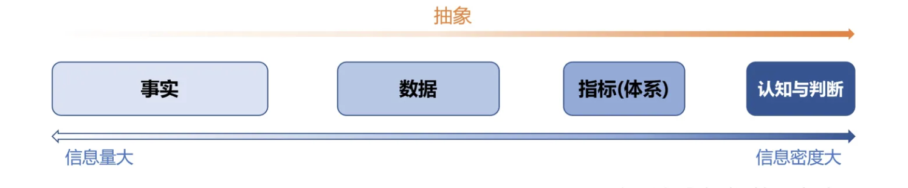

# 指标设计

## 什么是指标？

指标：**是一个被定义的数值，用来对事实进行抽象。**

---

## 如何理解指标

设想一下：

> 中年危机老贾去医院体检，咨询身体状况如何；医生说：“还行。有点问题。问题不大。”而不是告诉他血压如何、体脂如何、血糖如何。
法外狂徒小艺被查酒驾，交警质问他喝了多少；小艺说：“没醉。喝了一点。喝的不多。”交警却没有一个血液酒精含量的指标，去判断他是否醉驾，应该作何处罚。

倘若没有指标，我们能获得的信息，就会变的极度不稳定，而且十分有限。想要获取有价值信息的成本将会变得极高。

通过以上的案例，我们可以提取出那些信息呢？

- 他们的共性是什么？
  - 共性在于他们的载体都是数值。例如：身高180，体重100，温度40，GDP1w。
- 他们的差别是什么？
  - 差别在于它们的含义各不相同。例如：身高180和体重180所蕴含的含义是各不相同的。

> - 当一个事实比较简单的时候，例如某个物品的轻重，我们用通过质量这一个指标就可以衡量清楚。
> - 但当一个事实更复杂一些的时候，例如一个人的胖瘦，也许仅仅是用质量（体重）就不足以说明这个事实。这个时候我们可能会用BMI、体脂率等经过了两次抽象的指标。
> - 当这个事实变得更加复杂，例如一个国家的经济状况，我们会用GDP，这个一个进行了很多层复杂抽象、涉及到大量数据[1]的指标。甚至是仅仅一个指标也完全不足以描述出这个事实的重要特征；这时候就要设计一整套的指标体系，来量化这个复杂的事实。

---

## 指标的定义是什么

综上所述，一个指标应该至少要包含4各要素：

1. **名称**：指标名称要清晰明确，避免歧义，降低沟通成本
2. **责任人**：责任人要保证指标可维护、可运营
3. **含义**：指标含义要描述的是“被量化的事实”。例如：（这个指标处于什么场景下被设计出来的？所需要的数据从哪里获取？获取的失效如何？）
4. **口径**：指标口径要保证我们能及时地、准确的获取到所需的“数值”。例如：（这个指标是如何计算的？所需的数据是从哪获取的？获取的时效如何？）

---

## 如何设计一个指标？

结合统计和数据治理角度，我们可以将指标的设计过程分为三步：抽象、加工和限定。

---

## 指标可以用来干什么
## 我们可以从指标中获取那些价值

> 文章来源：https://zhuanlan.zhihu.com/p/399959450
