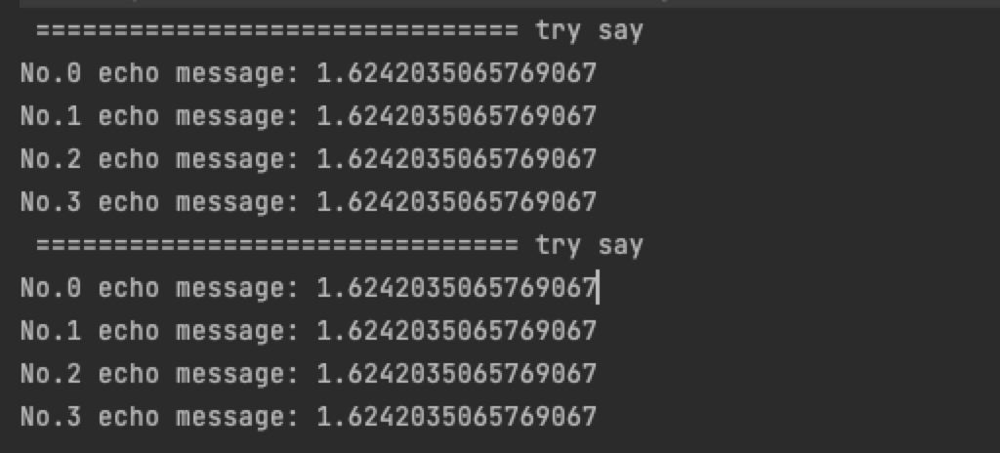

# Guice

## 让我们先来体验一下怎么使用Guice

### 样例代码

```java
package com.hwloser;

import com.google.inject.AbstractModule;
import com.google.inject.Guice;
import com.google.inject.Inject;
import com.google.inject.Injector;
import com.google.inject.Provides;
import com.google.inject.Scopes;
import com.google.inject.Singleton;
import java.lang.annotation.Retention;
import java.lang.annotation.RetentionPolicy;
import java.util.Random;

public class TestMain {
  public static void main(String[] args) {
    Injector injector = Guice.createInjector(new DemoModule());
    Greeter g1 = injector.getInstance(Greeter.class);
    Greeter g2 = injector.getInstance(Greeter.class);

    g1.sayHello();
    g2.sayHello();
  }

  // 1. 如果不指定单例，那么创建出来的则是原型(每次getInstance都会创建一个新的对象)对象
  //  @Singleton
  public static class Greeter {
    private final String message;
    private final Integer count;

    @Inject
    public Greeter(@Message String message, @Count Integer count) {
      this.message = message;
      this.count = count;
    }

    public void sayHello() {
      System.out.println(" =============================== try say");
      for (int i = 0; i < count; i++) {
        System.out.printf("No.%d echo message: %s%n", i, message);
      }
    }
  }

  @Retention(RetentionPolicy.RUNTIME)
  public @interface Count {}

  @Retention(RetentionPolicy.RUNTIME)
  public @interface Message {}

  public static class DemoModule extends AbstractModule {
    private final static Random r = new Random();
    @Override
    protected void configure() {
      bind(Greeter.class).in(Scopes.SINGLETON);
    }

    @Provides
    @Count
    public static Integer count() {
      return Math.max(1, r.nextInt(8));
    }

    @Provides
    @Message
    public static String message() {
      return Double.toString(r.nextGaussian());
    }
  }
}
```

### 代码解释

请不要直接复制以上的代码进行运行，调整包名，调整类名，即刻开始轻松体验。

我们先看一下结果：



结合main函数，我们看到，我们并没有给`Greeter`对象塞入任何的依赖，仅仅在`Greeter`的构造器中申明了两个注解`@Message`和`@Count`，我们就得到了如上的结果。

下面对Guice的概念和更深入的理解进行解释。

## 心智模型（Guice Mental Model）

!> *Learn about `Key`, `provider` and how Guice is just a map.*

从根本上来说，Guice可以提application创建并检索所需要的对象（依赖）。Guice可以替application从`Guice Map`中捕获所需要的对象（在应用程序中申明的对象）。`Guice Map`中的每一个`entry`包含了两部分:

- Guice key：key标记
- Provider：map对应的值

### Guice `Key`

简要的来说，Guice `Key` 是结合了注解（可选）的用于标识依赖的一种类型。

### Guice `Provider`

Guice的实现有多种方式

- 通过注解（需要在Guice的模块当中）
- 通过实现`Provider`方法（该方式中可以直接获取`guiceMap`来自定义依赖DAG）

