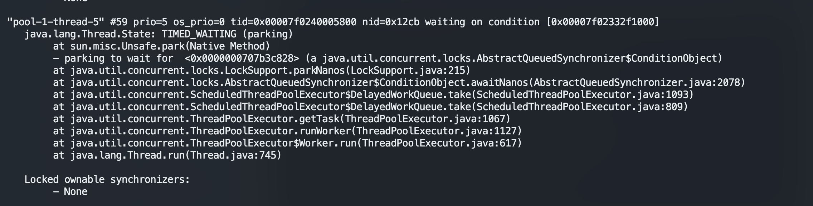
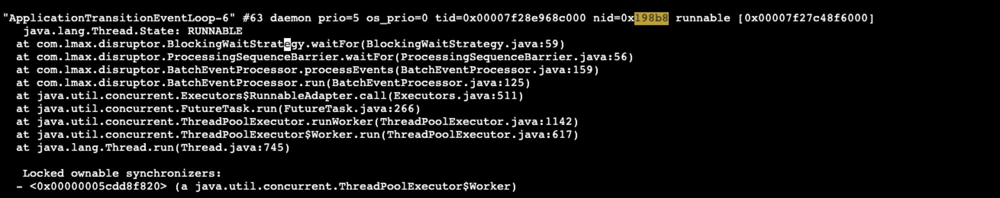

# 如何定位CPU占用率较高的任务

- 如何定位JVM进程
- 如何定位线程
- 如何查看具体线程的调用栈
- 如何判断CPU占用率较高的代码

## 如何定位JVM进程

```bash
# 1. 定位CPU占用率较高的进程ID
top
# then press P <which can sorted by CPU>
# 从这里找到进程id<process_id>

# 2. 确定占用的任务是jvm
jps -ml | grep process_id

```

## 如何定位线程

```bash
top -Hp process_id
# 通过CPU进行排序，找到线程ID<t_id>

# 因为jstack中的线程堆栈的t_id是16进制的，故而先转化为16进制
printf "%x\n" t_id
```

## 如何查看具体线程的调用堆栈

```bash
jstack -l process_id | grep -C <这里输入你想要显示的行数> t_id
```



### jvm线程状态描述

```bash
1)  死锁，Deadlock（重点关注）
2)  执行中，Runnable  
3)  等待资源，Waiting on condition（重点关注，等待什么资源）
4)  等待获取监视器，Waiting on monitor entry（重点关注）
5)  暂停，Suspended
6)  对象等待中，Object.wait() 或 TIMED_WAITING
7)  阻塞，Blocked（重点关注） 
8)  停止，Parked
```

## 如何判断CPU占用较高的代码

通过堆栈来判断RUNNABLE状态的任务执行的位置，来判断是否有一下几种类型：

1. 死循环
2. GC严重（这个请看jstat方面）
3. 等

## 案例

- disruptor占用大量的CPU问题



由上图我们可以看到disruptor，BatchProcess相关的线程，在进行等待上游数据中进行了自旋等待，那么这样就会对CPU的性能有所消耗.

- 解决方案

目前的性能消耗不高，等之后其他的任务部署之后，消耗还有所继续的话，就调整一下等待策略，避免不停的自旋导致CPU性能浪费。
