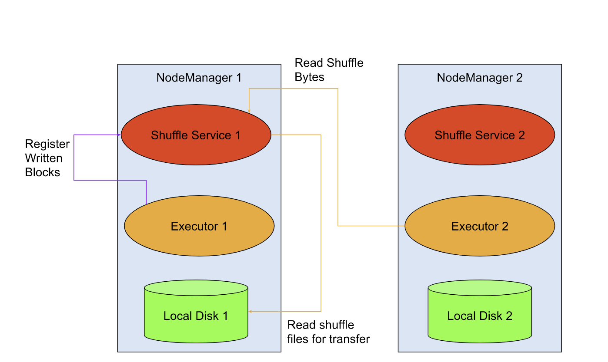
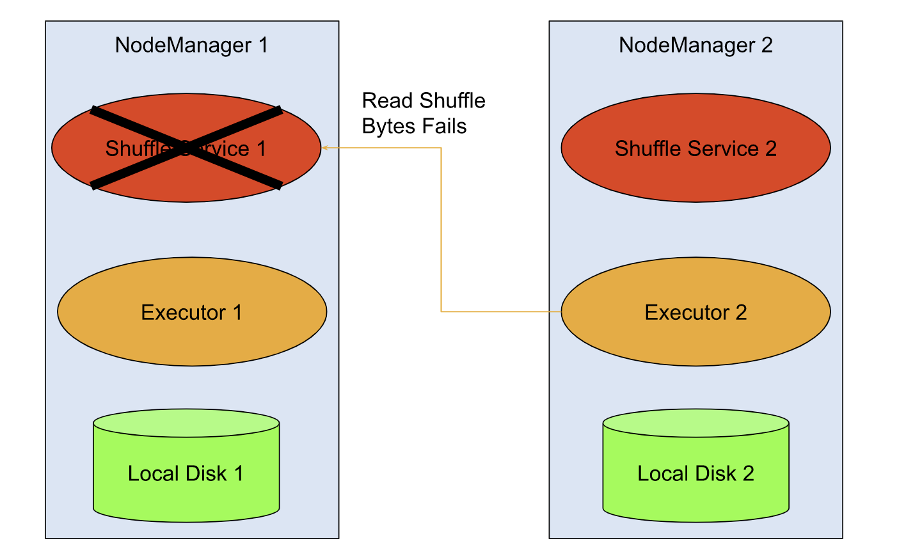

# Spark shuffle性能问题

- 分布式系统中，shuffle阶段被用于在多个计算单元间进行数据交换。
- Joining和Aggregate操作一般是需要借助于昂贵的shuffle操作的。
- 通过分区键将数据定位到相似的executor当中。

## spark引入external shuffle service < version - 1.2>

在当下，external shuffle service有什么问题呢？

当前的实现下，external shuffle service是运行在不同的机器当中来读取数据，
且在读取的过程中executor仍然想local storage中写入数据。

那么就会导致数据的可靠性和利用率的短板，尤其是在容器化的环境当中（k8s和mesos）。

如上图，YARN模式中的shuffle数据交换。这种模式下，executor2可以在executor1丢失后，荏苒可以从shuffle service1中读取。

总结问题：

- 隔离性缺失
  - shuffle service和其他的进程在YARN NodeManager中运行在同一个主机上，包括其他的spark应用。
  那么如果shuffle service发生故障，运行在YARN集群中的其他application就会收到影响。
  - shuffle service是运行在Node Manager当中的，那么如果shuffle service发生OOM，整个NodeManager就会处于不可用的状态。

- 扩展性问题
  - 同一台机器中的Spark应用中的全部的executor都向同一个local storage中写入数据。
  换句话说，就是单个shuffle service需要服务于全部的executor的读请求。
  这样，对于集群中磁盘的压力很难做出均衡（分散于集群中），会导致单点磁盘压力过大。
  因而，可想而知的是，压力过大的node会因为磁盘压力过载而暂停服务。

- 数据副本的缺失导致单点故障时引发血缘重新计算
  - executor仅会将数据写入到本地的存储当中，并且这份数据不会在集群中进行备份。
  那么意味着，如果executor写入的shuffle service宕机后，依赖于该shuffle service的全部的executor将无法进行读写，从而被触发重新计算。
   

如上图，当shuffle service1宕机后，所有对shuffle service1的读写请求将会失败。
整个application将会尝试重新计算存储于NodeManager1的shuffle文件。

