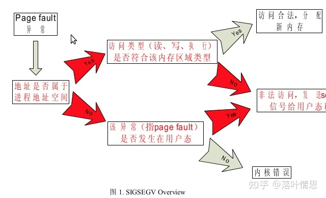
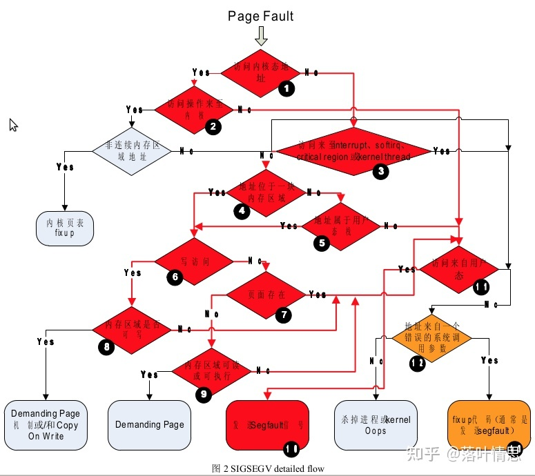

# SIGSEGV

## 一、段错误

!> A segmentation fault (often shortened to SIGSEGV) is a particular error condition that can occur during the operation of computer software. A segmentation fault occurs when a program attempts to access a memory location that it is not allowed to access, or attempts to access a memory location in a way that is not allowed (for example, attempting to write to a read-only location, or to overwrite part of the operating system).

!> Segmentation is one approach to memory management and protection in the operating system. It has been superseded by paging for most purposes, but much of the terminology of segmentation is still used, "segmentation fault" being an example. Some operating systems still have segmentation at some logical level although paging is used as the main memory management policy.

!> On Unix-like operating systems, a process that accesses an invalid memory address receives the SIGSEGV signal. On Microsoft Windows, a process that accesses invalid memory receives the STATUS_ACCESS_VIOLATION exception.

**Summary:**

1. SIGSEGV是在访问内存时发生的错误，它属于内存管理的范畴
2. SIGSEGV是一个用户态的概念，是操作系统在用户态沉痼错误访问内存时做出的处理
3. 当用户态程序访问（读、写或执行）不允许访问的内存时，发生SIGSEGV
4. 当用户态程序以错误的方式访问允许访问的内存时，发生SIGSEGV

---

### 摘要描述

- 当用户态程序访问一个会引发`SIGSEGV`的地址时，硬件首先会产生一个`page fault`，即`"缺页异常"`,
- 如果要访问的地址属于用户态地址空间，检查访问的类型是否和该内存区域的类型是否匹配，如果不匹配就会引发`SIGSEGV`,
- 如果该地址不属于用户态地址空间，检查访问该地址的操作是否发生在用户态，如果越界，则引发`SIGSEGV`。

## 二、指针越界

请看图：

