# presto SQL执行计划源码解析

---

## 前情提示

presto在对外的接口中使用RESTful接口对外提供服务。

这边仅分析`statement`接口。

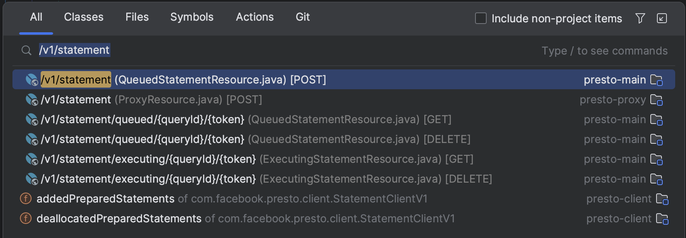

```sql
-- 模拟使用SQL：
select ds, count(1)
from (
SELECT car_id,ds,row_number() over (partition by ds order by car_id) rn
from dw.dw_zt_zto_scan_car
) as t
group by t.ds
limit 10
```

sql描述：该sql检索了`dw.dw_zt_zto_scan_car`这张表，这张表有且仅有一个分区`ds`，且该分区的数量极大：（10000个 - 本是用来测试 `FileList` 的性能）。

## 生成执行计划

1. 提交查询
2. 词法、语法分析
3. 语义分析
4. 执行计划
5. 优化执行计划
6. 执行计划分片（fragment）

### 提交查询

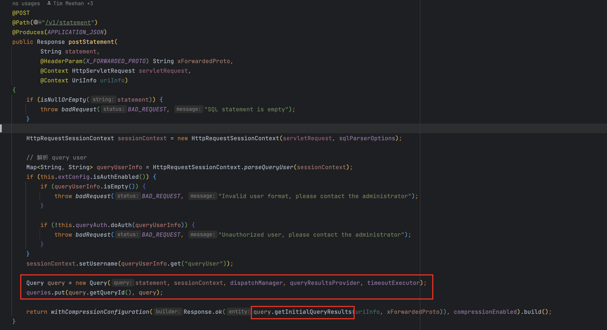

客户端提交的SQL文本会在这里被转化为Query对象，且由于是RESTful接口，这边会返回给客户端下一个要请求的URI，以便于客户端定位Query的执行状况。

在这里进行coordinator级别的查询索引，便于后续接口的调用：`queries.put(query.getQueryId(), query);`

### 初始化Statement - (词法、语法解析)

如下图，通过该方法异步的跟踪query的后续状态变化。如，词法、语法、语义解析等。

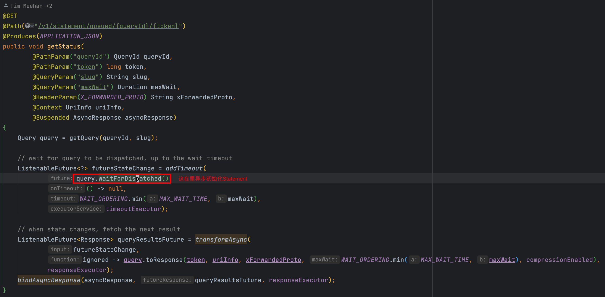

接下来，转换query为statement。

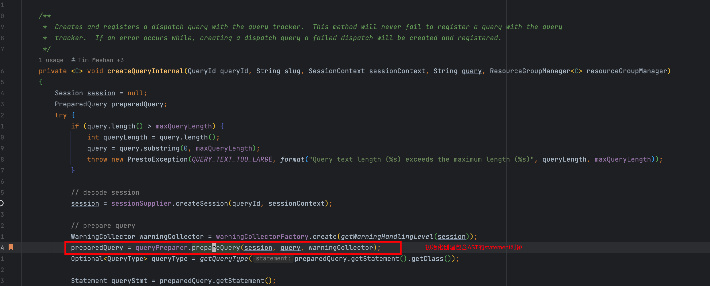
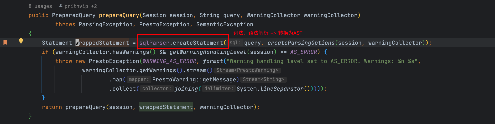

如上图，经过sql字符串的ANTLR字符引擎的递归解析之后，生成后续的AST（statement）。

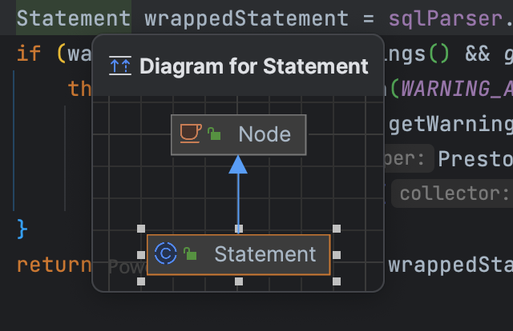

在解析完statement之后的同一个方法内，后续进行AST的语义分析和执行计划的生成。

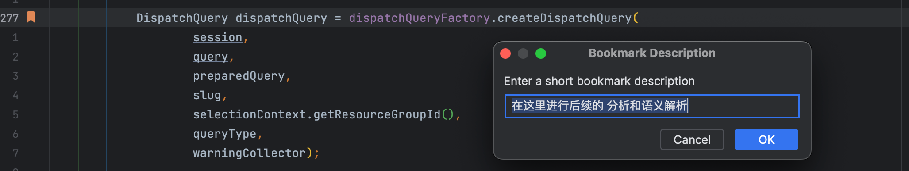

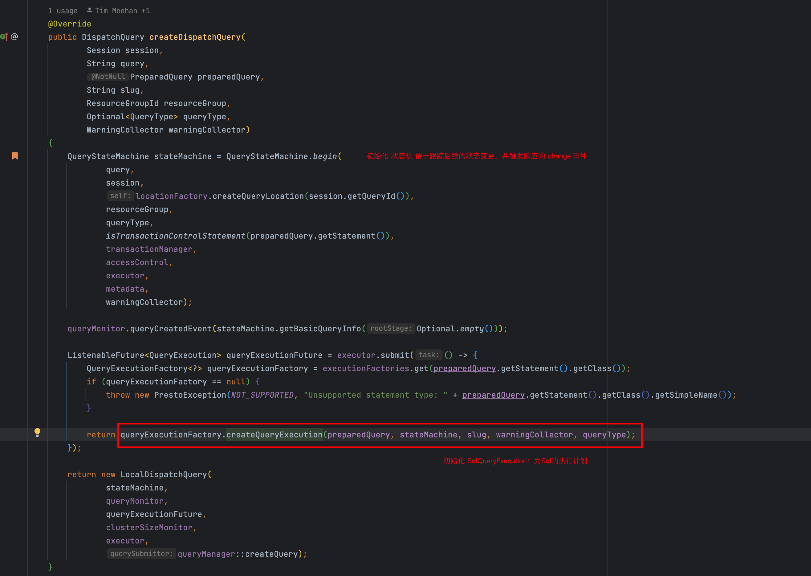

最后，创建`SqlQueryExecution`，用于后续的解析，优化和执行计划生成，以及最终的执行计划分片器（fragment）。

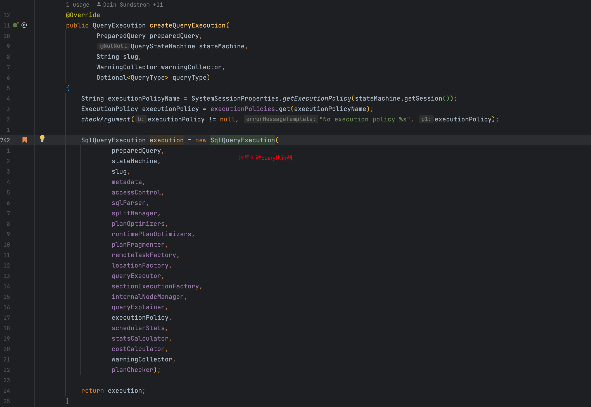

### 执行计划的生成以及前奏

- analyzer：（语义分析 - 结合metadata API）
- planer & optimizer：逻辑计划生成器和优化器
- fragmentPlaner：执行计划切片器（用于划分stage）

#### analyzer

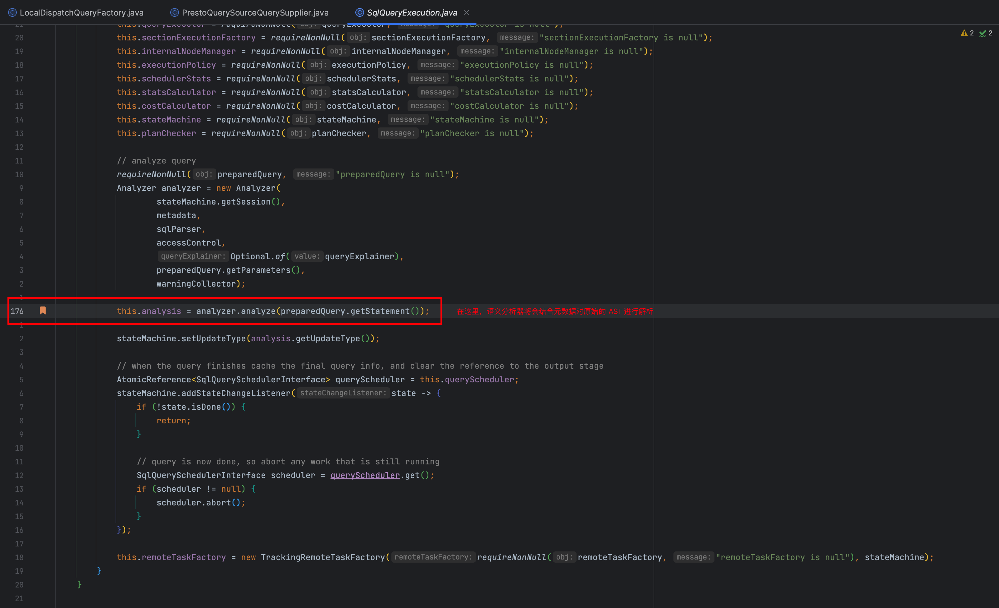

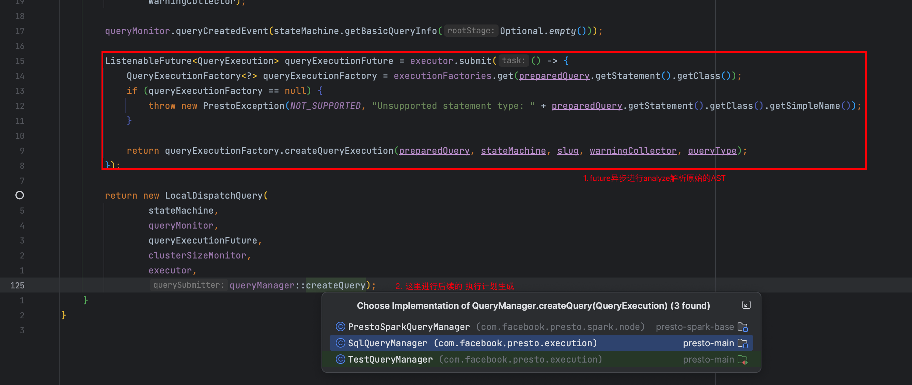

#### 后续过程

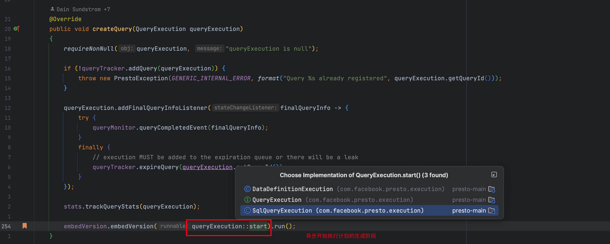

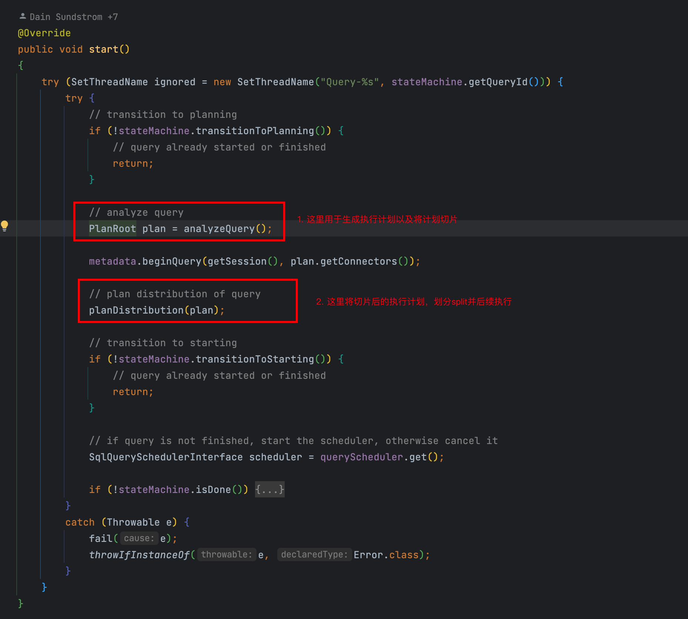

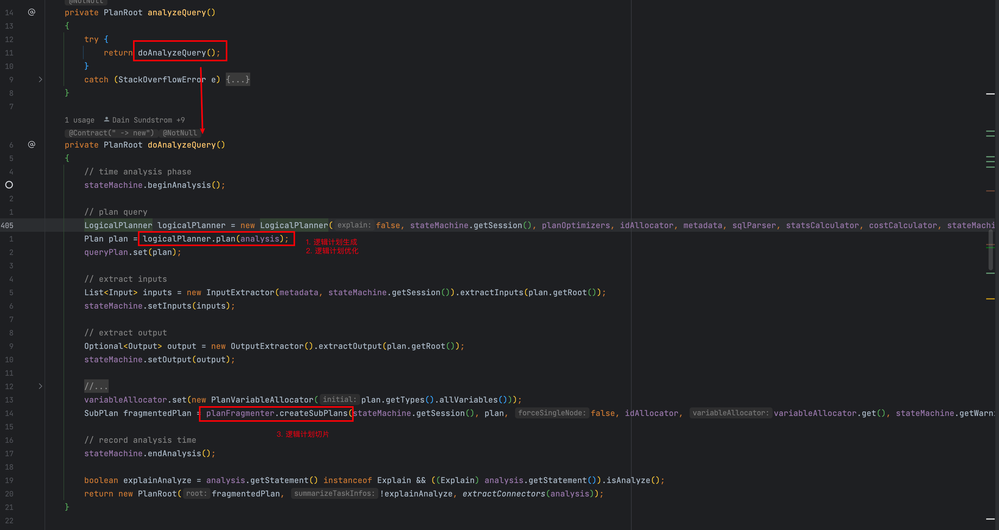

如上图，我们就已经将生成的过程描述完毕。

对planer的简单细说：

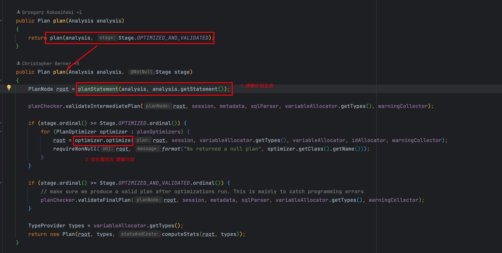

#### 对fragmenter的可视化的工具

presto提供了对sql拆分为fragment的explain查看方式，如下：

```sql
-- 1. 这里为执行的sql，通过explain analyze进行查看
presto:default> explain analyze select ds, count(1)
             -> from (
             -> SELECT car_id,ds,row_number() over (partition by ds order by car_id) rn
             -> from dw.dw_zt_zto_scan_car
             -> ) as t
             -> group by t.ds
             -> limit 10;
                                                                                                                                                     Query Plan                                                                            
-------------------------------------------------------------------------------------------------------------------------------------------------------------------------------------------------------------------------------------------
 -- 2. 这里是汇总fragment也就是 - single stage
 Fragment 1 [SINGLE]                                                                                                                                                                                                                       
     CPU: 3.81ms, Scheduled: 10.35ms, Input: 140 rows (4.50kB); per task: avg.: 140.00 std.dev.: 0.00, Output: 10 rows (329B)                                                                                                              
     Output layout: [ds, count]                                                                                                                                                                                                            
     Output partitioning: SINGLE []                                                                                                                                                                                                        
     Stage Execution Strategy: UNGROUPED_EXECUTION                                                                                                                                                                                         
     - Limit[10] => [ds:varchar, count:bigint]                                                                                                                                                                                             
             CPU: 0.00ns (0.00%), Scheduled: 0.00ns (0.00%), Output: 10 rows (329B)                                                                                                                                                        
             Input avg.: 10.00 rows, Input std.dev.: 0.00%                                                                                                                                                                                 
         - LocalExchange[SINGLE] () => [ds:varchar, count:bigint]                                                                                                                                                                          
                 CPU: 1.00ms (0.01%), Scheduled: 1.00ms (0.00%), Output: 10 rows (329B)                                                                                                                                                    
                 Input avg.: 8.75 rows, Input std.dev.: 170.83%                                                                                                                                                                            
             - RemoteSource[2] => [ds:varchar, count:bigint]                                                                                                                                                                               
                     CPU: 1.00ms (0.01%), Scheduled: 1.00ms (0.00%), Output: 140 rows (4.50kB)                                                                                                                                             
                     Input avg.: 8.75 rows, Input std.dev.: 170.83%                                                                                                                                                                        
                                                                                                                                                                                                                                           
 -- 3. 这里是用于交换数据的fragment - fixed stage
 Fragment 2 [HASH]                                                                                                                                                                                                                         
     CPU: 2.12s, Scheduled: 4.04s, Input: 10001 rows (408.64kB); per task: avg.: 2500.25 std.dev.: 48.14, Output: 640 rows (20.58kB)                                                                                                       
     Output layout: [ds, count]                                                                                                                                                                                                            
     Output partitioning: SINGLE []                                                                                                                                                                                                        
     Stage Execution Strategy: UNGROUPED_EXECUTION                                                                                                                                                                                         
     - LimitPartial[10] => [ds:varchar, count:bigint]                                                                                                                                                                                      
             CPU: 38.00ms (0.20%), Scheduled: 51.00ms (0.01%), Output: 640 rows (20.58kB)                                                                                                                                                  
             Input avg.: 156.25 rows, Input std.dev.: 8.34%                                                                                                                                                                                
         - Project[projectLocality = LOCAL] => [ds:varchar, count:bigint]                                                                                                                                                                  
                 CPU: 47.00ms (0.25%), Scheduled: 114.00ms (0.02%), Output: 10000 rows (320.72kB)                                                                                                                                          
                 Input avg.: 156.25 rows, Input std.dev.: 8.34%                                                                                                                                                                            
             - Aggregate(FINAL)[ds][$hashvalue] => [ds:varchar, $hashvalue:bigint, count:bigint]                                                                                                                                           
                     CPU: 223.00ms (1.16%), Scheduled: 247.00ms (0.04%), Output: 10000 rows (408.62kB)                                                                                                                                     
                     Input avg.: 156.27 rows, Input std.dev.: 8.35%                                                                                                                                                                        
                     Collisions avg.: 0.08 (43.04% est.), Collisions std.dev.: 394.44%                                                                                                                                                     
                     count := "presto.default.count"((count_23))                                                                                                                                                                           
                 - LocalExchange[HASH][$hashvalue] (ds) => [ds:varchar, count_23:bigint, $hashvalue:bigint]                                                                                                                                
                         CPU: 302.00ms (1.57%), Scheduled: 374.00ms (0.06%), Output: 10001 rows (408.65kB)                                                                                                                                 
                         Input avg.: 156.27 rows, Input std.dev.: 123.74%                                                                                                                                                                  
                     - RemoteSource[3] => [ds:varchar, count_23:bigint, $hashvalue_24:bigint]                                                                                                                                              
                             CPU: 219.00ms (1.14%), Scheduled: 391.00ms (0.06%), Output: 10001 rows (408.65kB)                                                                                                                             
                             Input avg.: 156.27 rows, Input std.dev.: 123.74%                                                                                                                                                              
                                                                                                                                                                                                                                           
 -- 4. 这里是读取数据源的fragment - source stage
 Fragment 3 [SOURCE]                                                                                                                                                                                                                       
     CPU: 18.45s, Scheduled: 10.28m, Input: 29997 rows (9.39MB); per task: avg.: 14998.50 std.dev.: 632.50, Output: 10001 rows (408.64kB)                                                                                                  
     Output layout: [ds, count_23, $hashvalue_25]                                                                                                                                                                                          
     Output partitioning: HASH [ds][$hashvalue_25]                                                                                                                                                                                         
     Stage Execution Strategy: UNGROUPED_EXECUTION                                                                                                                                                                                         
     - Aggregate(PARTIAL)[ds][$hashvalue_25] => [ds:varchar, $hashvalue_25:bigint, count_23:bigint]                                                                                                                                        
             CPU: 2.02s (10.51%), Scheduled: 2.93s (0.47%), Output: 10001 rows (408.64kB)                                                                                                                                                  
             Input avg.: 3.00 rows, Input std.dev.: 4698.30%                                                                                                                                                                               
             count_23 := "presto.default.count"(*)                                                                                                                                                                                         
         - ScanProject[table = TableHandle {connectorId='hive', connectorHandle='HiveTableHandle{schemaName=dw, tableName=dw_zt_zto_scan_car, analyzePartitionValues=Optional.empty}', layout='Optional[dw.dw_zt_zto_scan_car{}]'}, grouped
                 CPU: 16.33s (85.16%), Scheduled: 10.23m (99.34%), Output: 29997 rows (750.34kB)                                                                                                                                           
                 Input avg.: 3.00 rows, Input std.dev.: 4698.30%                                                                                                                                                                           
                 $hashvalue_25 := combine_hash(BIGINT 0, COALESCE($operator$hash_code(ds), BIGINT 0))                                                                                                                                      
                 LAYOUT: dw.dw_zt_zto_scan_car{}                                                                                                                                                                                           
                 ds := ds:string:-13:PARTITION_KEY                                                                                                                                                                                         
                     :: [[0000002220714212506, 2910309220714023334]]                                                                                                                                                                       
                 Input: 29997 rows (9.39MB), Filtered: 0.00% 
```

# 归纳总结

简单描述了，cooridnator从接受请求到解析落地执行计划的过程，后续会对AST遍历过程进行描述。
