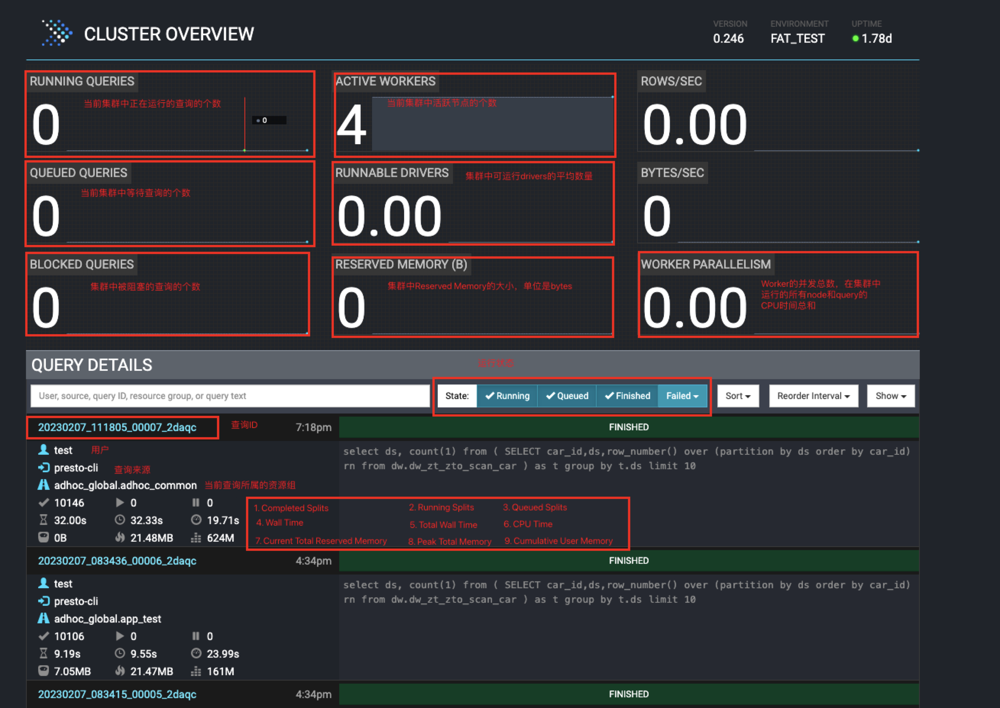
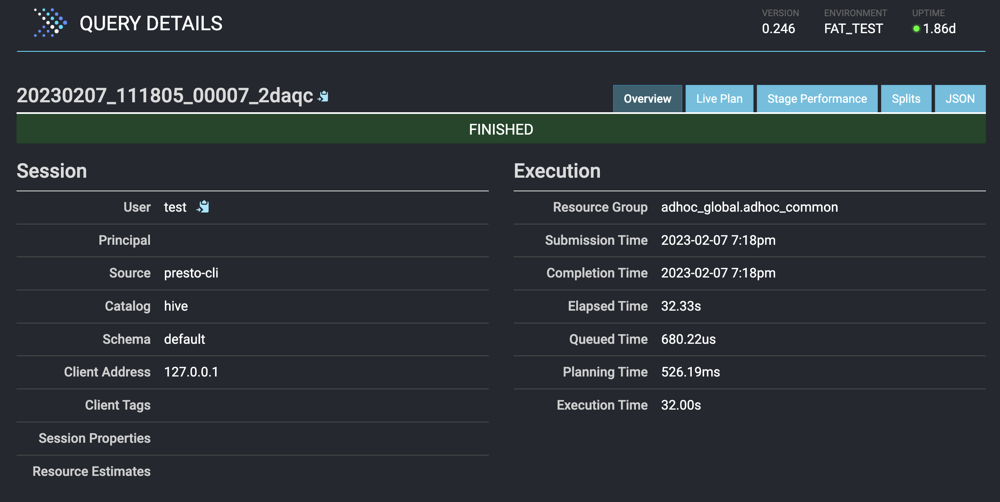
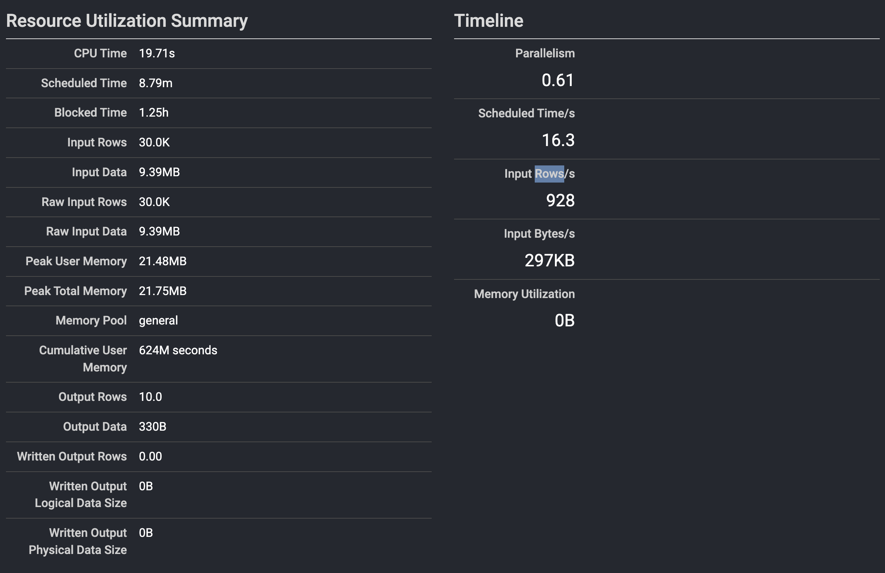
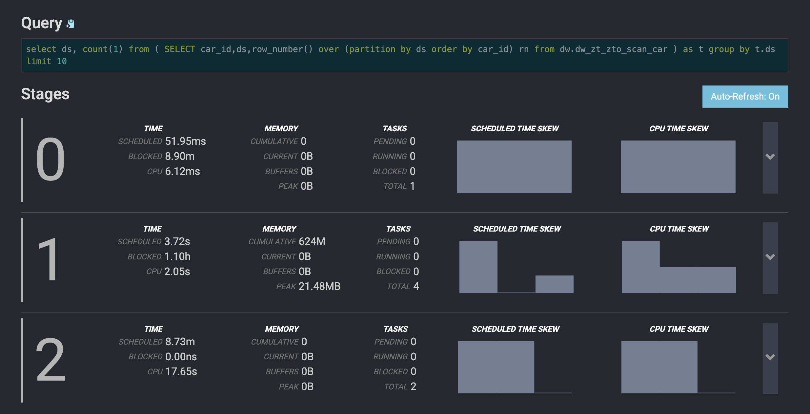
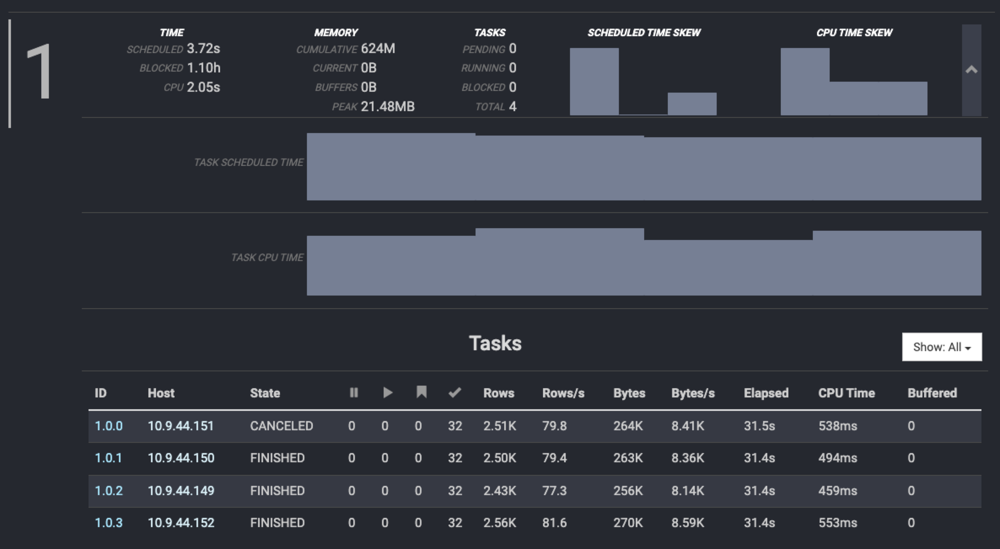
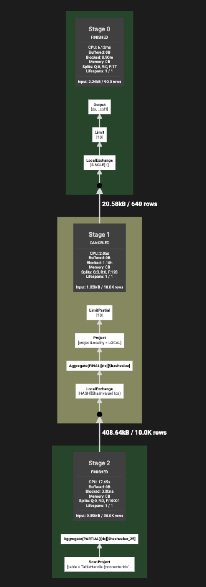

# Web UI详情介绍

---

## 摘要

- main page
- query details
- Live Plan

## 主页介绍

## 查询明细页面

会话信息和执行时间。

资源利用摘要和时间线。

查询字符串和stage信息。

对stage信息的描述：

> 前情描述：这段SQL底下的表是一张分区表，且分区数量多达`10000`。

其中每个stage中的指标：

- TIME
  1. SCHEDULED：在完成Stage的所有Task之前，该Stage被调度的时间
  2. BLOCK：因数据被阻塞的时间
  3. CPU：Stage中所有Task的总CPU时间
- MEMORY
  1. CAMULATIVE：整个Stage运行期间的累计内存
  2. CURRENT：当前Stage总共的内存
  3. BUFFERS：当前正在等待被处理的数据所消耗的内存
  4. PEAKS：该Stage的峰值总内存。可以用来了解当前Stage是否有操作消耗了大量的内存
- TAKS
  1. PENDING：Stage中待完成的Task数量。执行完毕时，该值变为0
  2. BLOCKED：Stage阻塞时Task的数量
  3. TOTAL：已经完成的Task的数量

stage展开后的task的明细(我们展开stage-1进行描述)：

1. ID：Task的唯一标识。「`StageID.TaskID`」
2. Host：Task运行所在的Worker节点IP/Domain。
3. Stage：Task的运行状态：`PENDING、RUNNING、BLOCKED、CANCELED、FINISHED`
4. ⏸️ Pending Splits：Task中正在运行的Split的数量
5. ▶️ Running Splits：Task中正在运行的Split数量
6. Blocked Splits：Task中处于阻塞状态的Split数量
7. ✅Completed Splits：Task中完成的Split
8. e.g.

## 执行计划

可以借助Live Plan实时查询执行处理过程。

