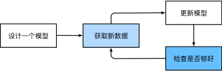

# 引言

我们通过一个样例来描述为什么需要机器学习的原因。

识别唤醒词：

那么，我们应该如何编写一个程序来响应一个唤醒词（比如：“siri”）？

**信息收集：**

- 麦克风每秒收集大约44000个样本，每个样本都是声波振幅的测量值。
- 而测量值和唤醒词很难直接进行关联。

**进一步问题描述**

那么我们的目的是：如何写一段程序，可以使得对于输入的数据（麦克风采集到的原始音频数据）来说，我们可以输出可靠的**预测**（是否做出响应）呢？

**思考**

通常，即使我们不知道怎样明确地告诉计算机如何从输入映射到输出，大脑仍然能够自己执行认知功能。 换句话说，即使我们不知道如何编写计算机程序来识别“Alexa”这个词，大脑自己也能够识别它。 有了这一能力，我们就可以收集一个包含大量音频样本的数据集（dataset），并对包含和不包含唤醒词的样本进行标记。 利用机器学习算法，我们不需要设计一个“明确地”识别唤醒词的系统。 相反，我们只需要定义一个灵活的程序算法，其输出由许多参数（parameter）决定，然后使用数据集来确定当下的“最佳参数集”，这些参数通过某种性能度量方式来达到完成任务的最佳性能。

那么到底什么是参数呢？参数可以被看作旋钮，旋钮的转动可以调整程序的行为。 任一调整参数后的程序被称为模型（model）。 通过操作参数而生成的所有不同程序（输入-输出映射）的集合称为“模型族”。 使用数据集来选择参数的元程序被称为学习算法（learning algorithm）。

---

## 如何训练模型

1. 从一个随机初始化参数的模型开始，这个模型基本上没有“智能”
2. 获取一些样本数据（例如：音频片段以及对应的是或否标签）
3. 调整参数，是模型在这些样本中表现的更好
4. 重复第2和第3步，知道模型在任务中的表现令人满意

总而言之，我们没有编写唤醒词识别器，而是编写了一个“学习”程序。如果我们用一个巨大的带标签的数据集，他很可能可以学习识别唤醒词。这种“通过用数据来确定程序行为”的方法可以被看作用*用数据编程*（programming with data）。比如，我们可以通过向机器学习系统，提供许多被猫和狗的图片来设计一个“猫图检测器”。检测器最终可以学会：如果输入是猫的图片就输出一个非常大的整数，如果输入是狗的图片就会输出一个非常小的负数。如果检测器不确定输入的图片中是否是猫还是狗，它会输出接近0的数。。。。

## 机器学习中的关键组件

首先介绍一些核心组件。无论什么类型的机器学习问题，都会遇到这些组件：

- 可以用来学习的数据（data）
- 如何转换数据的模型（model）
- 一个目标函数（objective function），用来量化模型的有效性
- 调整模型参数以优化目标函数的算法（algorithm）

### 数据

毋庸置疑的是，如果没有数据的话，那么数据科学将毫无用武之地。每个数据集由一个个样本（example，sample）组成，大多时候，他们遵循独立同分布（indendently and identically distrbutied，i.i.d）。样本有时候也叫做数据点（data point）或者数据实例（data instance），通常每个样本由一组称为*特征*（features，或*协变量*（covariates））组成。机器学习模型会根据这些属性进行预测。在上面的监督学习问题中，要预测的是一个特殊的属性，它被称为*标签*（label，或者*目标*（target））。

当处理图像数据时，每一张单独的照片即为一个样本，它的特征由每个像素数值的有序列表表示。 比如，200 x 200 彩色照片由 200 x 200 x 3 = 120000 个数值组成，其中的“3”对应于每个空间位置的红、绿、蓝通道的强度。 再比如，对于一组医疗数据，给定一组标准的特征（如年龄、生命体征和诊断），此数据可以用来尝试预测患者是否会存活。

当每个样本的特征数量都是相同的时候，其特征向量是固定长度的，这个长度被成为数据的*维度*（维数，dimensionality）。固定长度的特征向量是一个方便的属性，它可以用来量化学习大量的样本。

然而，并不是所有的数据都可以用固定长度的向量表示。以图像数据为例，如果他们全部来自标准显微镜设备，那么固定长度是可取的；但是如果图像的数据来自互联网，他们很难具有相同的分辨率或形状。这是，将图像裁剪成标准尺寸是一种办法，但这种办法很局限，有丢失信息的风险。此外，文本数据更不符合“固定长度”的要求，比如，对于亚马逊等电子商务网站上的客户评论，有些文本数据很简短（比如“好极了”），有些则长篇大论。与传统的机器学习方法相比，，深度学习的一个主要优势是可以处理不同长度的数据。

一般来说，拥有越多的数据的时候，工作就越容易。更多的数据可以被用来训练出更强大的模型，从而减少对预先设想假设的依赖。数据集的由小到大为现代深度学习的成功奠定了基础。在没有大数据集的情况下，许多令人兴奋的深度学习模型黯然失色。就算一些深度学习模型在小数据集上能够工作，担起效能并不比传统的方法高。

请注意，

- 仅仅拥有海量的数据是不够的，我们还需要正确的数据，但数据中充满了错误，或者如果数据的特征不能预测任务的目标，那么模型很可能无效。
- 还有一种常见的问题来自不均衡的数据集，比如在一个有关医疗的训练数据集中，默写人群没有样本表示。想象一下，假设我们想要训练一个皮肤癌识别模型。但它（在训练数据集中）从未“见过”黑色皮肤的人群,这个模型就会束手无策。

### 模型

大多数机器学习会涉及到数据的转换。比如一个“摄取照片并检测笑容”的系统。再比如通过摄取到的一组传感器读数的正常与异常程度。深度学习与经典方法的区别主要在于：前者关注的功能强大的模型，这些模型由神经网络错组复杂的交织在一起，包含层层数据转换，硬刺被成为*深度学习*（deep learning）。

### 目标函数

前面的学习将机器学习介绍为”从经验中学习“。这里所说的”学习“，是指自主提高模型完成某些任务的效能。但是，什么才算是真正的提高呢？在机器学习中，我们需要定义模型的优劣程度的度量，这个度量在大多数情况下是”可优化“的，这被称为目标函数（objective function）。我们通常定义一个目标函数，并希望能优化它到最低点。因为越低越好，所以这些函数有时北城为*损失函数*（loss function，或cost function）。但这只是一个惯例，我们也可以取一个新的函数，以优化到它的最高点。这两个函数本质上是相同的，只是反转一下符号。

当任务在试图预测数值的时候，最常见的损失函数是*平方误差*（squared error），即预测值与实际值之差的平方。当试图解决分类问题的时候，最常见的目标函数是以最小化错误率，即预测与实际情况不符的样本比例。有些目标函数（如平方误差）很容易被优化，有些目标（如错误率）由于不可微性或其他复杂性难以直接优化。这些情况下通常会优化替代目标。

通常损失函数是根据模型参数定义的，并取决于数据集上，我们可以通过最小化损失来学习模型参数的最佳值。该数据集由一些为训练而收集的样本组成，称为*训练数据集*（training dataset，或称为*训练集*（training set）。然而，在训练数据上表现良好的模型，并不一定在“新数据集”上有同样的性能，这里的“新数据集”通常称为*测试数据集*（test dataset，或称为*测试集*（test set）。

综上所述，可用数据集通常可以分成两部分：训练数据集用于拟合模型参数，测试数据集用于评估拟合的模型。 然后我们观察模型在这两部分数据集的性能。 “一个模型在训练数据集上的性能”可以被想象成“一个学生在模拟考试中的分数”。 这个分数用来为一些真正的期末考试做参考，即使成绩令人鼓舞，也不能保证期末考试成功。 换言之，测试性能可能会显著偏离训练性能。 当一个模型在训练集上表现良好，但不能推广到测试集时，这个模型被称为过拟合（overfitting）的。 就像在现实生活中，尽管模拟考试考得很好，真正的考试不一定百发百中。

### 优化算法

当我们获得了一些数据源及其表示、一个模型和一个合适的损失函数，接下来就需要一种算法，它能够搜索出最佳的参数，以最下滑损失函数。深度学习中大多流行的优化算法通常基于一种基本方法-*梯度下降*（gradient descent）。简而言之，在每一步骤中，梯度下降法都会检查每个参数，看看如果仅对该参数进行少量变动，训练集损失会朝那个方向移动。然后，它在可以减少损失的方向上优化参数。

